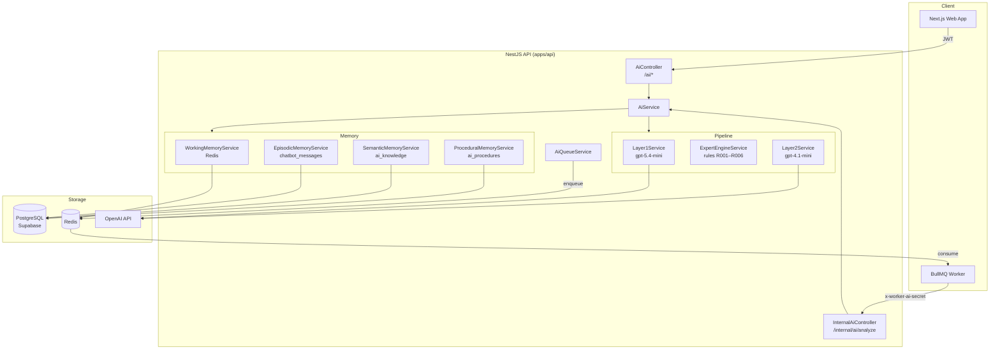
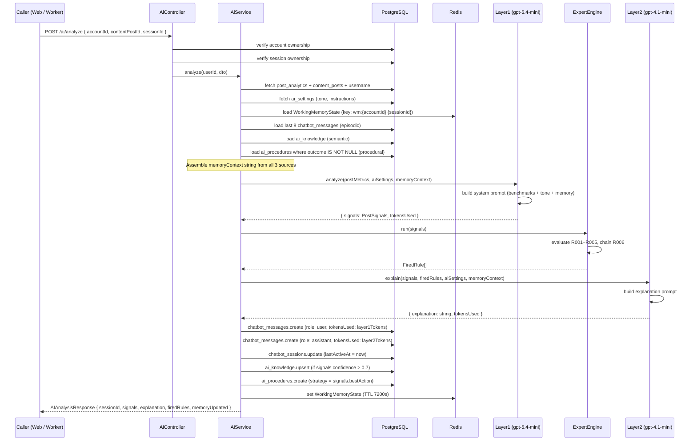
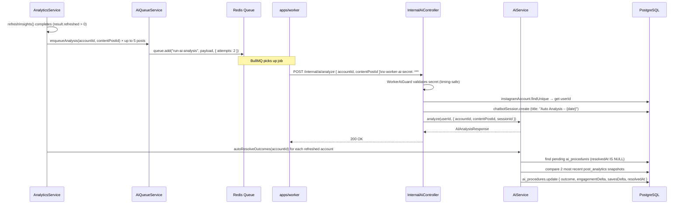
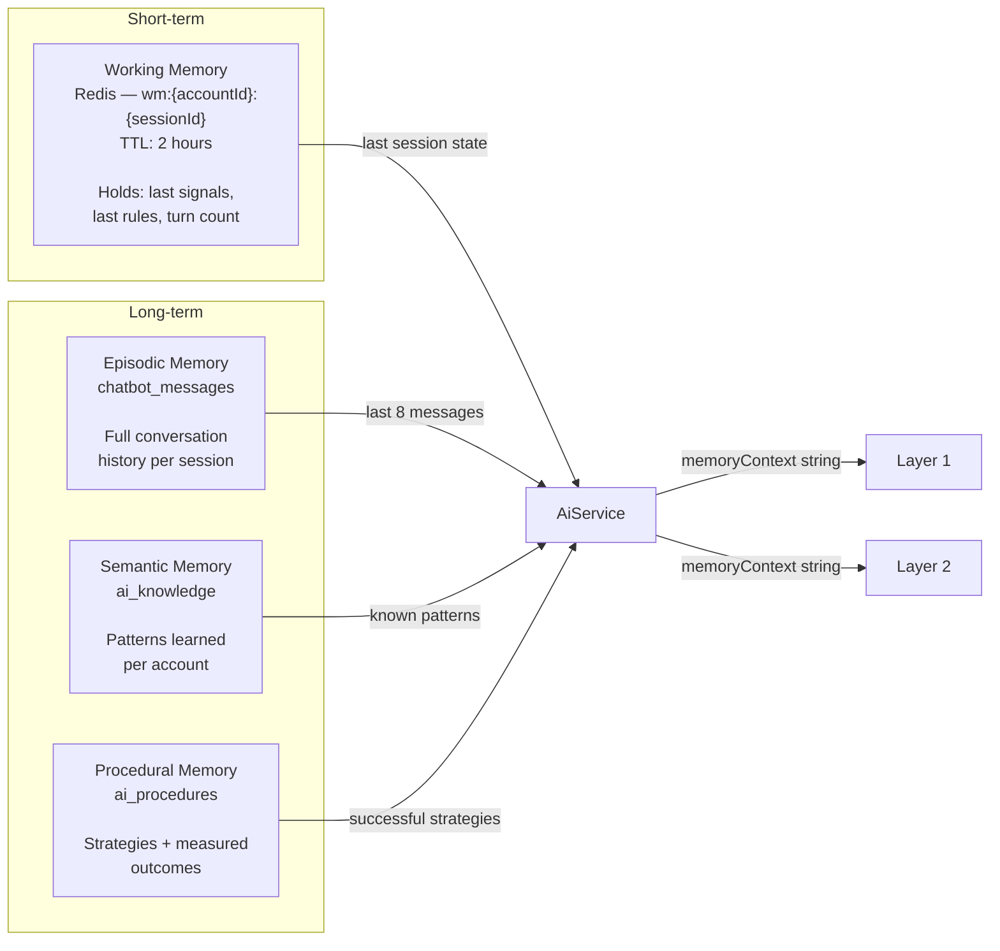
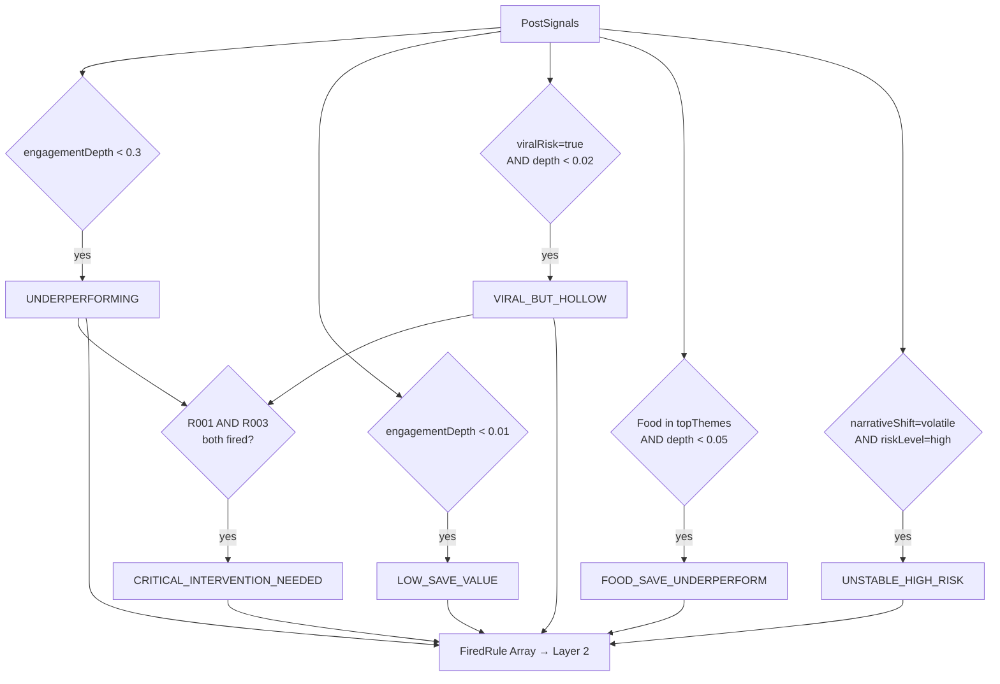
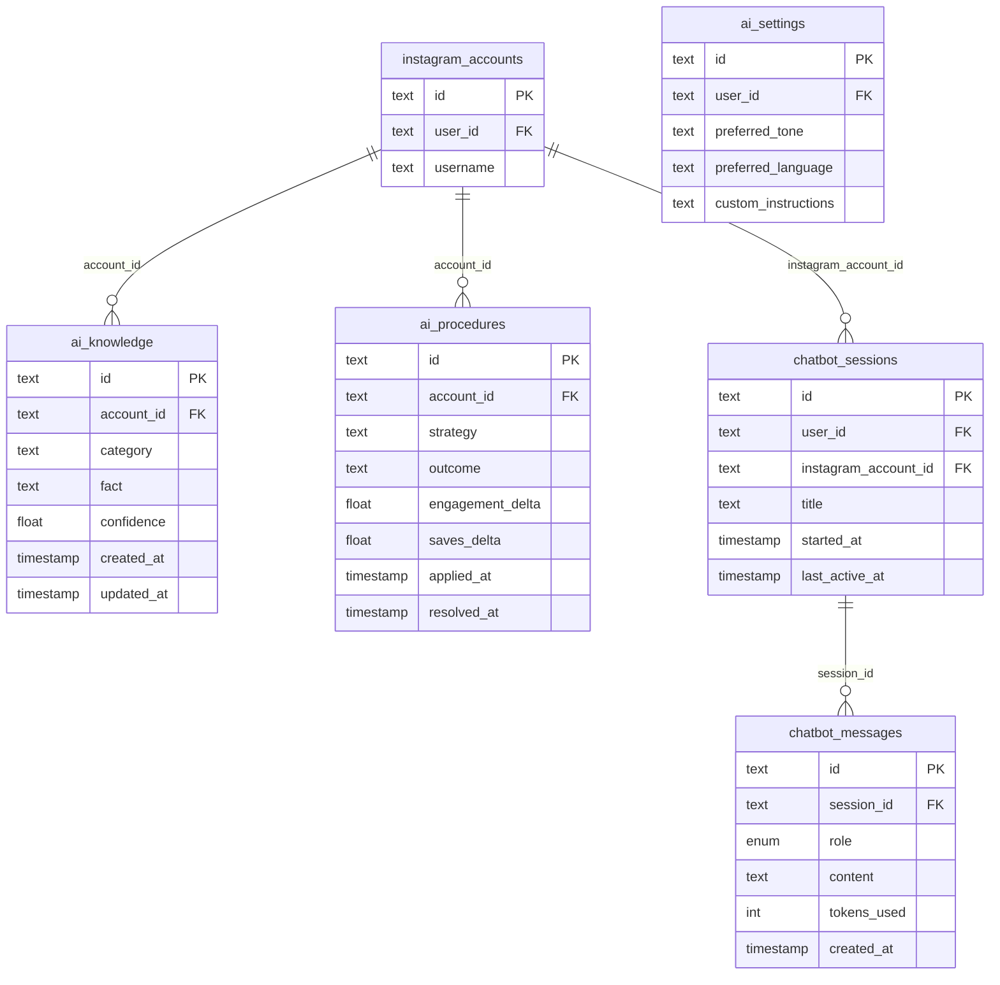

# AI Module

Last updated: 2026-05-30

This document covers everything added and changed when the AI module was built for Social Manager App.

---

## What it does

The AI module provides Instagram post analytics intelligence. When a user triggers an analysis on a published post, the system:

1. Fetches the post's raw analytics from the database (`post_analytics`)
2. Sends the metrics to Layer 1 (OpenAI) which produces structured `PostSignals`
3. Runs an expert rules engine on the signals to detect specific performance patterns
4. Sends signals + fired rules to Layer 2 (OpenAI) which produces a plain-English explanation
5. Persists the conversation to `chatbot_messages` and updates all memory layers
6. Returns the analysis to the caller

It also supports a general chat endpoint that reuses the Layer 2 model with memory context.

---

## Architecture

```
POST /ai/analyze
      │
      ├─ Fetch post_analytics + content_posts (PrismaService)
      ├─ Fetch ai_settings (personalization)
      ├─ Load WorkingMemory (Redis)
      ├─ Load EpisodicMemory (chatbot_messages)
      ├─ Load SemanticMemory (ai_knowledge)
      ├─ Load ProceduralMemory (ai_procedures)
      │
      ├─ Layer1Service → OpenAI → PostSignals (JSON)
      ├─ ExpertEngineService → FiredRule[]
      ├─ Layer2Service → OpenAI → explanation (prose)
      │
      ├─ Save messages to chatbot_messages
      ├─ Update ai_knowledge, ai_procedures
      └─ Update WorkingMemory (Redis)

POST /internal/ai/analyze   ← called by BullMQ worker (no JWT, uses x-worker-ai-secret)
      └─ auto-creates ChatbotSession, then calls analyze()

Queue: ai-analysis (BullMQ)
      └─ enqueued by AiQueueService after analytics refresh (up to 5 posts)
```

---

## New files

### packages/types/src/

| File | Purpose |
|---|---|
| `ai.ts` | Shared TypeScript interfaces: `PostSignals`, `AIAnalysisRequest`, `AIAnalysisResponse`, `FiredRule`, `WorkingMemoryState` |

### apps/api/src/ai/

| File | Purpose |
|---|---|
| `ai.module.ts` | NestJS module. Registers all providers. Provides Redis client via `REDIS_CLIENT` token. Exports `AiService` and `AiQueueService` for use in other modules. |
| `ai.controller.ts` | Public API endpoints (all require Supabase JWT). See endpoint table below. |
| `ai.service.ts` | Orchestration: `analyze()`, `chat()`, `analyzeInternal()`, `getSettings()`, `upsertSettings()`, `resolveOutcome()`, `autoResolveOutcomes()`, session CRUD, memory clear. |
| `ai-queue.service.ts` | Enqueues `ai-analysis` BullMQ jobs with lazy Redis connection and attempts=2. |
| `internal-ai.controller.ts` | `POST /internal/ai/analyze` — no JWT, protected by `WorkerAiGuard`. Auto-creates session if none provided. |
| `guards/worker-ai.guard.ts` | Checks `x-worker-ai-secret` header using timing-safe comparison against `WORKER_AI_SECRET` env var. |
| `dto/analyze.dto.ts` | `AnalyzeDto` — accountId, contentPostId, sessionId, userMessage? |
| `dto/chat.dto.ts` | `ChatDto` — accountId, sessionId, message (max 1000 chars) |
| `dto/create-session.dto.ts` | `CreateSessionDto` — accountId, title? |
| `dto/upsert-settings.dto.ts` | `UpsertSettingsDto` — preferredTone?, customInstructions? (max 2000), preferredLanguage? |
| `dto/resolve-outcome.dto.ts` | `ResolveOutcomeDto` — outcome, engagementDelta, savesDelta |
| `dto/queue-analysis.dto.ts` | `QueueAnalysisDto` — accountId, contentPostId, sessionId? |
| `memory/working-memory.service.ts` | Redis-backed working memory. Key: `wm:{accountId}:{sessionId}`. TTL: 7200s. |
| `memory/episodic-memory.service.ts` | Reads/writes `chatbot_messages` and `chatbot_sessions`. |
| `memory/semantic-memory.service.ts` | Reads/writes `ai_knowledge`. Upserts by `accountId+category+fact`. |
| `memory/procedural-memory.service.ts` | Reads/writes `ai_procedures`. |
| `layers/layer1.service.ts` | Calls OpenAI with JSON mode. Returns `{ signals: PostSignals, tokensUsed: number }`. Uses `OPENAI_MODEL_LAYER1` (fallback: `gpt-5.4-mini`). System prompt includes category-specific saves/reach benchmarks and traffic source context derived from the portfolio dataset. |
| `layers/layer2.service.ts` | Calls OpenAI for prose explanation. Returns `{ explanation: string, tokensUsed: number }`. Uses `OPENAI_MODEL_LAYER2` (fallback: `gpt-4.1-mini`). Throws `BadRequestException` on failure. `memoryContext` is injected into the system prompt (not the user message). |
| `expert/rules.ts` | Pure TypeScript function `evaluateRules(signals)`. No NestJS. |
| `expert/engine.service.ts` | NestJS injectable wrapper around `evaluateRules`. Adds R006 chain detection. |
| `expert/rules.spec.ts` | 11 unit tests covering all rules and boundary conditions. |

### scripts/

| File | Purpose |
|---|---|
| `scripts/test-ai-layers.mjs` | Standalone smoke test. Runs the full Layer1 → rules → Layer2 pipeline against real OpenAI with fake post data. No server, DB, or Redis needed. Run with `node scripts/test-ai-layers.mjs`. |

---

## Modified files

| File | What changed |
|---|---|
| `packages/database/prisma/schema.prisma` | Added `AiKnowledge` and `AiProcedure` models. Added `aiKnowledge` and `aiProcedures` reverse relations to `InstagramAccount`. |
| `packages/types/src/index.ts` | Re-exports all types from `ai.ts`. |
| `apps/api/src/app.module.ts` | Imports `AiModule`. |
| `apps/api/src/analytics/analytics.module.ts` | Imports `AiModule` to get `AiQueueService` and `AiService`. |
| `apps/api/src/analytics/analytics.service.ts` | After a successful `refreshInsights`, enqueues AI analysis jobs (up to 5 posts) and runs `autoResolveOutcomes` for each refreshed account. Both injections are `@Optional()` so analytics still works if AI is disabled. |
| `apps/api/package.json` | Added `openai` dependency. |
| `apps/worker/src/index.ts` | Added `ai-analysis` BullMQ worker. Updated shutdown to close both workers. |
| `.env.example` | Added `OPENAI_API_KEY`, `OPENAI_MODEL_LAYER1`, `OPENAI_MODEL_LAYER2`, `WORKER_AI_SECRET`. |

---

## New database tables

Both tables require a migration (`prisma migrate dev`) before use.

### `ai_knowledge`

Stores patterns the AI has learned about an account.

| Column | Type | Notes |
|---|---|---|
| `id` | text (cuid) | PK |
| `account_id` | text | FK → instagram_accounts |
| `category` | text | e.g. `top_theme`, `audience_behavior` |
| `fact` | text | The learned pattern |
| `confidence` | float | 0–1, updated on upsert |
| `created_at` | timestamp | |
| `updated_at` | timestamp | |

### `ai_procedures`

Stores recommended strategies and their measured outcomes.

| Column | Type | Notes |
|---|---|---|
| `id` | text (cuid) | PK |
| `account_id` | text | FK → instagram_accounts |
| `strategy` | text | The recommended action |
| `outcome` | text? | `positive` / `negative` / custom — null until resolved |
| `engagement_delta` | float? | Change in engagement after strategy applied |
| `saves_delta` | float? | Change in saves after strategy applied |
| `applied_at` | timestamp | When the strategy was recommended |
| `resolved_at` | timestamp? | When outcome was measured |

---

## API endpoints

All public endpoints require a Supabase JWT (`Authorization: Bearer <token>`). All queries are scoped to the authenticated user's accounts and sessions.

| Method | Path | Auth | Description |
|---|---|---|---|
| `POST` | `/ai/analyze` | JWT | Run full analysis on a published post |
| `POST` | `/ai/analyze/queue` | JWT | Enqueue an async analysis job |
| `POST` | `/ai/chat` | JWT | General conversation using memory context |
| `GET` | `/ai/sessions/:accountId` | JWT | List sessions for an account (last 20) |
| `GET` | `/ai/sessions/:sessionId/messages` | JWT | Get messages in a session |
| `POST` | `/ai/sessions` | JWT | Create a new session |
| `DELETE` | `/ai/memory/:accountId/working` | JWT | Clear Redis working memory for an account |
| `GET` | `/ai/settings` | JWT | Get the user's AI settings |
| `PUT` | `/ai/settings` | JWT | Create or update AI settings |
| `POST` | `/ai/procedures/:procedureId/resolve` | JWT | Manually resolve a procedure outcome |
| `POST` | `/internal/ai/analyze` | Worker secret | Called by BullMQ worker via `x-worker-ai-secret` |

---

## Expert rules

Rules are evaluated in `expert/rules.ts` as pure TypeScript. The engine adds a chained rule (R006).

| Rule | Condition | Conclusion |
|---|---|---|
| R001 | `engagementDepth < 0.3` | `UNDERPERFORMING` |
| R002 | `savesReachRatio < 0.01` | `LOW_SAVE_VALUE` |
| R003 | `viralRisk=true AND savesReachRatio < 0.02` | `VIRAL_BUT_HOLLOW` |
| R004 | `topThemes includes 'Food' AND savesReachRatio < 0.05` | `FOOD_SAVE_UNDERPERFORM` |
| R005 | `narrativeShift=volatile AND riskLevel=high` | `UNSTABLE_HIGH_RISK` |
| R006 | R001 AND R003 both fired | `CRITICAL_INTERVENTION_NEEDED` |

`aspectBreakdown.engagementDepth` in `PostSignals` is the raw saves/reach ratio (e.g. `0.008` = 0.8%), not a normalized 0–1 score. Layer 1 is prompted to output it this way.

---

## Environment variables

Add these to your `.env` file (see `.env.example`):

```bash
OPENAI_API_KEY=sk-...
OPENAI_MODEL_LAYER1=gpt-5.4-mini      # fast JSON signal extraction
OPENAI_MODEL_LAYER2=gpt-4.1-mini      # prose explanation
WORKER_AI_SECRET=<random-hex-32>       # shared between API and worker
```

Generate `WORKER_AI_SECRET` with:
```bash
openssl rand -hex 32
```

---

## How the memory system works

| Layer | Storage | Purpose |
|---|---|---|
| Working | Redis (`wm:{accountId}:{sessionId}`, TTL 2h) | Short-term state across turns in a session |
| Episodic | `chatbot_messages` table | Full conversation history per session |
| Semantic | `ai_knowledge` table | Persistent patterns learned per account |
| Procedural | `ai_procedures` table | Strategies recommended + their measured outcomes |

`autoResolveOutcomes()` is called automatically after analytics refresh. It compares the two most recent `post_analytics` snapshots for an account and closes any pending `ai_procedures` with a `positive` or `negative` outcome and the computed deltas.

---

## Testing

**Smoke test (no infrastructure needed):**
```bash
node scripts/test-ai-layers.mjs
```

**Unit tests (expert rules):**
```bash
corepack pnpm --filter api test -- rules.spec.ts
```

**Full API checks:**
```bash
corepack pnpm --filter api typecheck
corepack pnpm --filter api lint
corepack pnpm --filter api build
```

---
---

## Deep dive

The sections below go into more detail on flows, data shapes, and how to extend the system.

---

## System architecture diagram



---

## Full analyze sequence



---

## Worker / async flow



---

## Memory system diagram



### What goes into memoryContext

Each memory layer contributes a plain-text block appended to the OpenAI system prompt:

```
Recent conversation:
User: analyze
Assistant: Your post scored well on reach but saves are below average...

Known patterns:
[top_theme] Recipe content (confidence: 0.84)
[audience_behavior] Posts with step-by-step instructions save 3× better (confidence: 0.79)

Past strategies:
Strategy: Add numbered recipe steps → positive (saves delta: +12)
Strategy: Post between 7–9pm → pending
```

---

## Layer 1 — signal extraction

Layer 1 receives raw post metrics and returns structured `PostSignals` as JSON (`response_format: json_object`).

**Input:**
```json
{
  "postId": "abc123",
  "caption": "Check out this pasta recipe! 🍝 Save for later!",
  "postType": "FEED",
  "likeCount": 312,
  "commentsCount": 18,
  "sharesCount": 7,
  "savesCount": 41,
  "reach": 4800,
  "impressions": 6200,
  "engagement": 378,
  "accountUsername": "my_food_account"
}
```

**Output:**
```json
{
  "postId": "abc123",
  "overallSentiment": "positive",
  "sentimentScore": 0.88,
  "dominantEmotion": "excitement",
  "aspectBreakdown": {
    "contentQuality": 0.82,
    "postingTiming": 0.61,
    "audienceReach": 0.58,
    "engagementDepth": 0.0085
  },
  "topThemes": ["recipe discovery", "food inspiration", "save-for-later utility"],
  "narrativeShift": "stable",
  "strategicSignals": {
    "riskLevel": "low",
    "opportunity": "Strong save intent — optimize with clearer step-by-step structure",
    "urgency": "medium",
    "viralRisk": false
  },
  "bestAction": "Add numbered steps and a stronger CTA to save",
  "confidence": 0.84
}
```

**Key field — `engagementDepth`:** Layer 1 is instructed to output the **raw saves/reach decimal** here (e.g. `0.0085` = 0.85%), not a normalized 0–1 score. Expert rule thresholds (0.01, 0.02, 0.05) operate on this value.

**Category-specific benchmarks in system prompt** (derived from the 500-row portfolio dataset):

| Category | saves/reach avg | Notes |
|---|---|---|
| Fashion | 0.18 | Highest in portfolio — benchmark for save depth |
| Food | 0.012 | Lowest despite reasonable reach — flag if below 0.05 |
| Comedy | highest ceiling | Highest volatility — don't over-index on one viral post |
| Travel | high volatility | Similar caution as Comedy |
| Technology | moderate saves | Inconsistent engagement — interest without emotional resonance |
| All others | 0.08 avg | Beauty, Fitness, Lifestyle, Music, Photography |

**Traffic source context also in system prompt:**
- **Explore** — strongest follower-conversion source; high-reach + low saves = wasted opportunity
- **Reels Feed** — high reach, lowest follower conversion; prioritize saves over reach
- **Home Feed + Hashtags** — balanced conversion, ~550 followers gained per post average

| Parameter | Value |
|---|---|
| Model | `OPENAI_MODEL_LAYER1` (fallback: `gpt-5.4-mini`) |
| Temperature | `0.1` — deterministic JSON |
| Max tokens | `400` via `max_completion_tokens` |
| Response format | `json_object` |

---

## Layer 2 — explanation

Layer 2 receives `PostSignals` + `FiredRule[]` and returns 2–3 paragraphs of plain-English coaching. `memoryContext` is injected into the **system prompt** (alongside tone/instructions), not the user message — so the model treats it as background knowledge rather than data to analyze.

**Correct `engagementDepth` thresholds used in system prompt:**
- `< 0.01` — content not perceived as worth saving → add evergreen value and stronger save CTA
- `< 0.03` — below average save performance for this portfolio → strengthen content utility and hook structure

**Error behaviour:** throws `BadRequestException` on failure — no silent fallback. Both layers now fail loudly so the caller can handle errors correctly.

**Example output:**
```
Your latest post is resonating well in terms of excitement and positive sentiment,
scoring 0.88. However, the engagement depth (saves/reach) is just 0.0085 — below
the 0.01 floor — meaning fewer than 1% of reached users saved it.

The saves-to-reach ratio of 0.85% signals the content is being seen but not valued
enough to keep. Since your audience already shows intent to save recipe content, the
fix is structural: lead with a numbered breakdown (Step 1, Step 2...) and close with
a direct CTA like "Save this for your next dinner night."

Content quality is strong at 0.82 and risk is low — small caption tweaks here are a
high-reward, low-risk move.
```

| Parameter | Value |
|---|---|
| Model | `OPENAI_MODEL_LAYER2` (fallback: `gpt-4.1-mini`) |
| Temperature | `0.4` — slightly creative but grounded |
| Max tokens | `400` via `max_completion_tokens` |
| On failure | throws `BadRequestException('Explanation generation failed')` |

---

## Expert rules flow



---

## PostSignals full schema

```typescript
interface PostSignals {
  postId: string;

  overallSentiment: 'positive' | 'negative' | 'neutral' | 'mixed';
  sentimentScore:   number;   // 0–1
  dominantEmotion:  string;   // excitement | trust | anticipation | nostalgia | inspiration | FOMO | curiosity

  aspectBreakdown: {
    contentQuality:  number | null;  // 0–1 quality score (caption, CTA, hashtags)
    postingTiming:   number | null;  // 0–1 alignment with peak audience hours
    audienceReach:   number | null;  // 0–1 reach quality (unique reached / followers)
    engagementDepth: number | null;  // raw saves/reach ratio — e.g. 0.008 = 0.8%
  };

  topThemes:      string[];   // e.g. ["recipe discovery", "food inspiration"]
  narrativeShift: 'improving' | 'declining' | 'stable' | 'volatile';

  strategicSignals: {
    riskLevel:   'low' | 'medium' | 'high';
    opportunity: string | null;
    urgency:     'low' | 'medium' | 'high';
    viralRisk:   boolean;  // true if reach/impressions > 0.7 AND high engagement
  };

  bestAction: string;   // single recommended action
  confidence: number;   // 0–1 overall analysis confidence
}
```

---

## Database ER diagram



---

## Setup checklist

```bash
# 1. Add env vars to .env
echo "OPENAI_API_KEY=sk-..." >> .env
echo "OPENAI_MODEL_LAYER1=gpt-5.4-mini" >> .env
echo "OPENAI_MODEL_LAYER2=gpt-4.1-mini" >> .env
echo "WORKER_AI_SECRET=$(openssl rand -hex 32)" >> .env

# 2. Run database migration (creates ai_knowledge and ai_procedures tables)
corepack pnpm --filter @social-manager/database prisma:migrate

# 3. Regenerate Prisma client
corepack pnpm --filter @social-manager/database prisma:generate

# 4. Smoke test (no server needed, just OPENAI_API_KEY)
node scripts/test-ai-layers.mjs

# 5. Build everything
corepack pnpm --filter api build
corepack pnpm --filter worker build
```

---

## How to extend

### Add a new expert rule

1. Open `apps/api/src/ai/expert/rules.ts`
2. Add a new block inside `evaluateRules()` following the existing pattern
3. Add a test in `rules.spec.ts`
4. No other files need changing — the output flows automatically to Layer 2

### Add a new semantic memory category

Call `SemanticMemoryService.upsert()` from `AiService` with any string category:

```typescript
await this.semanticMemory.upsert(accountId, 'posting_time', 'Best engagement 7–9pm', 0.81);
```

It will appear in the next analysis under `Known patterns:`.

### Change which model each layer uses

Set `OPENAI_MODEL_LAYER1` or `OPENAI_MODEL_LAYER2` in `.env`. No code change needed. Models newer than `gpt-4` require `max_completion_tokens` — this is already in use, do not revert to `max_tokens`.

### Personalize per user

Users call `PUT /ai/settings` with `preferredTone` and `customInstructions`. Both are injected into Layer 1 and Layer 2 system prompts automatically on every analysis.

---

## Troubleshooting

| Symptom | Likely cause | Fix |
|---|---|---|
| Worker jobs always fail with 401 | `WORKER_AI_SECRET` not set or mismatched between API and worker | Set the same value in `.env` for both |
| `BadRequestError: max_tokens not supported` | Newer OpenAI model deprecated the parameter | Already fixed — both layers use `max_completion_tokens` |
| `Layer1 analysis failed` in logs | Invalid JSON from model or wrong `response_format` | Check `OPENAI_MODEL_LAYER1`; some models need `json_schema` instead of `json_object` |
| `Explanation generation failed` (400) returned to caller | Layer 2 OpenAI call failed | Check `OPENAI_API_KEY` and `OPENAI_MODEL_LAYER2`; Layer 2 now throws instead of returning a silent empty string |
| `ai_knowledge` / `ai_procedures` table not found | Migration not run | `corepack pnpm --filter @social-manager/database prisma:migrate` |
| Working memory always empty | Redis not running or wrong `REDIS_URL` | Check connection; working memory degrades gracefully (returns null, analysis still runs) |
| Analytics refresh doesn't enqueue AI jobs | Wiring issue | Confirm `analytics.module.ts` imports `AiModule` and `AnalyticsService` has `@Optional() private readonly aiQueue` |
| Explanation ignores past context | Memory empty on first run | Expected — context builds after first few analyses per account |
