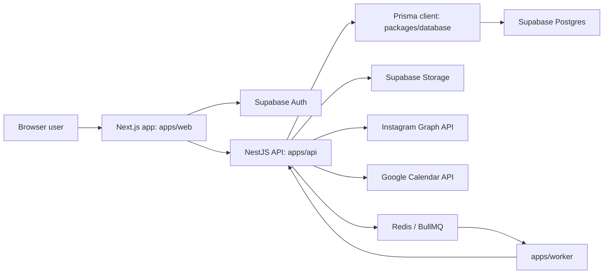
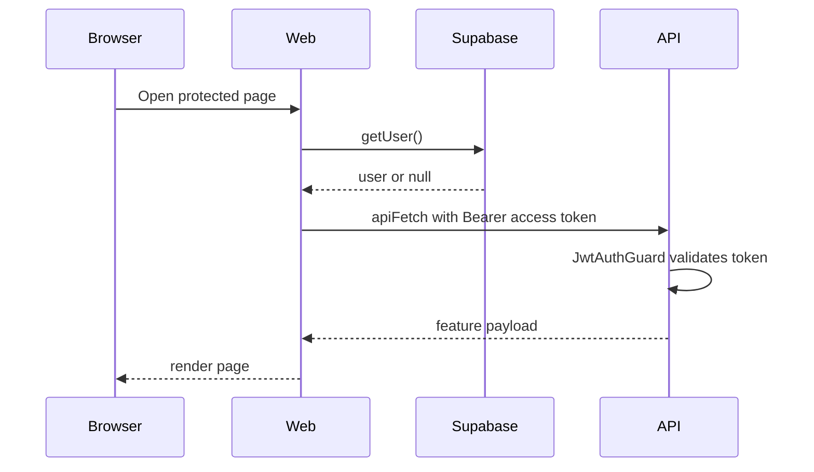

# Social Manager App Handbook

Last updated: 2026-05-24

This is the current onboarding document for humans and AI agents working on
Social Manager App. It describes what the app does, where code lives, how data
moves through the system, and which commands verify changes.

## Product Summary

Social Manager App is a dashboard for managing Instagram accounts and content.
The current product surface includes:

| Area | What it does |
|---|---|
| Auth | Supabase email auth and session middleware. |
| Dashboard | Account overview, connected Instagram accounts, upload stats, content rows, calendar summary. |
| Calendar | Schedule posts, create drafts, upload media, approve posts, retry failed publishes, inspect post details. |
| Analytics | Account-filtered Instagram analytics, manual insight refresh, media previews, notes, recent post details, and side-by-side account comparison. |
| Messages | Instagram DM conversation surface backed by the Instagram API module. |
| Chat AI | Shell for future AI assistant workflows. |
| Worker | BullMQ worker that publishes scheduled posts by calling the guarded API route. |

## Architecture



### Main Boundaries

| Boundary | Responsibility |
|---|---|
| `apps/web` | UI, auth-gated pages, server-side data fetches, client mutations. |
| `apps/api` | Protected REST API, business rules, Prisma access, external API integrations. |
| `apps/worker` | Background scheduled publishing jobs. |
| `packages/database` | Prisma schema, migrations, generated Prisma client export. |
| `packages/types` | Shared TypeScript types that are not Prisma-specific. |
| `packages/config` | Shared TypeScript config. |
| `infra/docker` | Dockerfiles and Compose files for local/prod container setups. |

## Local Setup

### Requirements

- Node.js from `.node-version`
- Corepack with pnpm
- PostgreSQL connection through Supabase
- Redis for scheduled publishing
- Supabase project for Auth, Postgres, and Storage

### Environment

Copy `.env.example` to `.env` at the repository root and fill the values.

Important groups:

| Group | Variables |
|---|---|
| Web | `NEXT_PUBLIC_API_URL`, `NEXT_PUBLIC_SUPABASE_URL`, `NEXT_PUBLIC_SUPABASE_PUBLISHABLE_KEY`, `NEXT_PUBLIC_SITE_URL` |
| API | `PORT`, `WEB_ORIGIN`, `DATABASE_URL`, `DIRECT_URL`, `SUPABASE_*`, `ENCRYPTION_KEY` |
| Instagram | `META_INSTAGRAM_APP_ID`, `META_INSTAGRAM_APP_SECRET`, `META_REDIRECT_URI`, `META_GRAPH_API_VERSION`, `META_INSTAGRAM_SCOPES`, `META_OAUTH_STATE_SECRET` |
| Google | `GOOGLE_OAUTH_CLIENT_ID`, `GOOGLE_OAUTH_CLIENT_SECRET`, `GOOGLE_OAUTH_REDIRECT_URI` |
| Queue/Worker | `REDIS_URL`, `WORKER_PUBLISH_SECRET`, `API_BASE_URL`, `PUBLISH_WORKER_CONCURRENCY`, `PUBLISH_REQUEST_TIMEOUT_MS` |

Notes:

- `ENCRYPTION_KEY` must be a 64-character hex string for AES-256-GCM token encryption.
- `DATABASE_URL` is used by the running app; `DIRECT_URL` is used by Prisma migrations.
- The web app expects the non-standard public Supabase env name `NEXT_PUBLIC_SUPABASE_PUBLISHABLE_KEY`.

### Install And Generate

```bash
corepack pnpm install
corepack pnpm --filter @social-manager/database prisma:generate
```

### Run Locally

Use separate terminals:

```bash
corepack pnpm --filter api dev
corepack pnpm --filter web dev
corepack pnpm --filter worker dev
```

Default URLs:

| Service | URL |
|---|---|
| Web | `http://localhost:3000` |
| API | `http://localhost:3001` |
| Redis | `redis://localhost:6379` |

### Database Commands

```bash
corepack pnpm --filter @social-manager/database prisma:generate
corepack pnpm --filter @social-manager/database prisma:migrate
corepack pnpm --filter @social-manager/database prisma:migrate:deploy
```

Use `prisma:migrate` for local migration development. Use
`prisma:migrate:deploy` in deployed environments.

## Web App Guide

### App Router Pages

| Route | File | Purpose |
|---|---|---|
| `/` | `apps/web/app/page.tsx` | Auth page. |
| `/auth/callback` | `apps/web/app/auth/callback/route.ts` | Supabase auth callback. |
| `/auth/popup-complete` | `apps/web/app/auth/popup-complete/page.tsx` | Popup login completion page. |
| `/dashboard` | `apps/web/app/dashboard/page.tsx` | Main dashboard overview. |
| `/dashboard/instagram/callback` | `apps/web/app/dashboard/instagram/callback/route.ts` | Instagram OAuth callback bridge. |
| `/dashboard/messages` | `apps/web/app/dashboard/messages/page.tsx` | Instagram DM page. |
| `/calendar` | `apps/web/app/calendar/page.tsx` | Scheduling calendar. |
| `/analytics` | `apps/web/app/analytics/page.tsx` | Analytics overview and compare mode. |
| `/chat` | `apps/web/app/chat/page.tsx` | Chat surface. |
| `/chat-ai` | `apps/web/app/chat-ai/page.tsx` | AI chat surface. |

### Auth Pattern

Protected pages are Server Components. They:

1. Check required public Supabase env vars.
2. Create the Supabase server client with `@/lib/supabase/server`.
3. Call `supabase.auth.getUser()`.
4. Redirect unauthenticated users to `/`.
5. Fetch API data through server helpers in `apps/web/lib`.

The shared sidebar receives a profile generated from the Supabase user.

### API Fetch Helpers

| Helper | File | Use from |
|---|---|---|
| `apiFetch` | `apps/web/lib/api/client.ts` | Server Components, Server Actions, Route Handlers. |
| `apiFetchBrowser` | `apps/web/lib/api/browser-client.ts` | Client Components. |
| `ApiError` | `apps/web/lib/api/error.ts` | Error UI and mutation handling. |
| `buildApiUrl` | `apps/web/lib/api/url.ts` | Shared URL construction. |

Both fetch helpers:

- Build URLs from `NEXT_PUBLIC_API_URL`.
- Attach the Supabase access token when `auth` is true.
- Retry once after a `401` by refreshing the Supabase session.
- Serialize object bodies as JSON.
- Throw `ApiError` for non-2xx responses.

### Data Fetch Pattern

Feature pages use `apps/web/lib/*-data.ts` helpers. The standard pattern is:

```ts
export async function getFeatureData(): Promise<FeatureData> {
  try {
    return await apiFetch<FeatureData>("/feature/endpoint");
  } catch (error) {
    console.error("getFeatureData failed", error);
    return EMPTY_FEATURE;
  }
}
```

Presentation components receive data by prop and render empty states for
`null`, `[]`, or missing values. Do not put dummy production data in components.

### Styling

- Tailwind CSS v4 is configured through `apps/web/app/globals.css`.
- Design tokens are CSS variables such as `--chart-1`, `--chart-3`, `--color-*`.
- Use `lucide-react` icons where possible.
- Keep route-specific components in `app/<route>/_components`.
- Use the `@/` import alias inside `apps/web`.

## Backend API Guide

### Runtime Rules

- `apps/api` uses ESM with `"type": "module"`.
- Internal TypeScript imports must include `.js`, for example
  `import { AuthModule } from './auth/auth.module.js';`.
- Use NestJS HTTP exceptions instead of throwing generic `Error` for request
  failures.
- Import Prisma enums and types from `@social-manager/database`, not
  `@prisma/client`.
- Sensitive fields such as encrypted access tokens must never be selected for
  ordinary API responses.

### API Modules

| Module | Main files | Responsibility |
|---|---|---|
| App | `app.module.ts`, `main.ts` | Bootstrap, config, throttling, module registration. |
| Auth | `auth/*` | Supabase JWT validation and user sync. |
| Instagram | `instagram/*` | Account connection, OAuth, webhooks, DM, profile avatars, summary metrics. |
| Dashboard | `dashboard/*` | Dashboard aggregate endpoint. |
| Analytics | `analytics/*` | Analytics overview, insight refresh, analytics notes. |
| Calendar | `calendar/*` | Scheduling event feed and post workflow routes. |
| Media | `media/*` | Signed upload URLs and media asset records. |
| Publishing | `publishing/*` | Instagram publishing and worker-triggered scheduled publishes. |
| Queue | `queue/*` | BullMQ job creation, replacement, and removal. |
| Google | `integrations/google/*` | Google OAuth and Calendar events. |
| Prisma | `prisma/*` | Global PrismaService. |

### Endpoint Map

All routes below are relative to `NEXT_PUBLIC_API_URL`.

| Area | Endpoint | Notes |
|---|---|---|
| Health | `GET /` | Basic API check. |
| Auth | `GET /auth/me`, `POST /auth/sync` | Protected by Supabase JWT guard where appropriate. |
| Dashboard | `GET /dashboard/overview` | Authenticated dashboard payload. |
| Instagram accounts | `GET /instagram/accounts`, `POST /instagram/accounts`, `DELETE /instagram/accounts/:accountId` | Account CRUD and avatar data. |
| Instagram OAuth | `GET /instagram/oauth/url`, `POST /instagram/oauth/callback` | Connect Instagram through Meta login. |
| Instagram summary | `GET /instagram/analytics/summary` | Dashboard-oriented Instagram summary. |
| Instagram DMs | `GET /instagram/dm/conversations`, `GET /instagram/dm/conversations/:conversationId`, `POST /instagram/dm/conversations/:conversationId/messages` | DM surfaces. |
| Instagram webhooks | `GET /instagram/webhooks`, `POST /instagram/webhooks` | Meta webhook verification and ingestion. |
| Calendar | `GET /calendar/events`, `POST /calendar/events` | Date-range event feed and create flow. |
| Calendar work | `GET /calendar/work-items`, `GET /calendar/failed-posts` | Approval/draft/failure panels. |
| Calendar post detail | `GET /calendar/posts/:contentPostId` | Post modal detail. |
| Calendar post mutation | `PATCH /calendar/posts/:contentPostId/draft`, `PATCH /calendar/posts/:contentPostId/scheduled`, `POST /calendar/posts/:contentPostId/approve`, `POST /calendar/posts/:contentPostId/retry`, `DELETE /calendar/posts/:contentPostId` | Draft, schedule, approve, retry, delete. |
| Media | `POST /media/upload-urls`, `POST /media/assets` | Supabase Storage upload flow. |
| Analytics | `GET /analytics/overview` | Supports `accountId` and `range`. |
| Analytics refresh | `POST /analytics/insights/refresh` | Fetches current Instagram insight snapshots. |
| Analytics notes | `POST /analytics/notes`, `PATCH /analytics/notes/:noteId`, `DELETE /analytics/notes/:noteId` | Notes are user-owned and optionally account-scoped. |
| Google | `GET /integrations/google/auth`, `GET /integrations/google/callback`, `POST /integrations/google/link`, `GET /integrations/google/calendar`, `GET /integrations/google/calendar/events`, `GET /integrations/google/status`, `DELETE /integrations/google` | Google Calendar integration. |
| Worker publish | `POST /internal/publishing/scheduled/:contentPostId` | Guarded by `WORKER_PUBLISH_SECRET`; called by worker. |

## Data Model

The Prisma schema is in `packages/database/prisma/schema.prisma`.

### Core Models

| Model | Purpose |
|---|---|
| `User` | App user synced from Supabase Auth. |
| `InstagramAccount` | Connected Instagram account, encrypted access token, account metadata, avatar URL. |
| `ContentPost` | Draft, scheduled, pending approval, or published content item. Failed publish state is derived from `PublishAttempt`. |
| `PostMedia` | Join between posts and uploaded media assets. |
| `MediaAsset` | Supabase Storage-backed image/video record. |
| `PublishAttempt` | Records publish attempts and failures. |
| `PostAnalytics` | Per-post insight snapshots such as likes, comments, shares, saves, reach, impressions. |
| `AnalyticsNote` | User notes attached to analytics, optionally scoped to an Instagram account. |
| `AnalyticsSnapshot` | Account-level analytics snapshot model. |
| `GoogleIntegration` | Encrypted Google refresh token and connection state. |
| `InstagramStory` | Instagram story tracking. |
| `DmConversation`, `DmMessage` | Instagram DM data. |
| `WebhookEvent` | Raw/processed webhook tracking. |
| `AiSettings`, `ChatbotSession`, `ChatbotMessage` | AI/chatbot storage. |

### Important Enums

| Enum | Values |
|---|---|
| `InstagramAccountType` | `PERSONAL`, `BUSINESS`, `CREATOR` |
| `MediaType` | `IMAGE`, `VIDEO` |
| `PostType` | `FEED`, `REEL`, `STORY`, `CAROUSEL` |
| `PostStatus` | `DRAFT`, `PENDING`, `READY`, `PUBLISHED` |
| `PublishTrigger` | `MANUAL`, `SCHEDULED`, `RETRY` |
| `PublishAttemptStatus` | `STARTED`, `SUCCESS`, `FAILED` |
| `WebhookSource` | `INSTAGRAM`, `FACEBOOK` |
| `WebhookProcessingStatus` | `RECEIVED`, `PROCESSED`, `FAILED` |
| `DmSenderType` | `USER`, `PARTICIPANT` |
| `ChatbotMessageRole` | `USER`, `ASSISTANT` |

## Feature Data Flows

### Login And Page Load



### Instagram Account Connection

1. Web requests `GET /instagram/oauth/url`.
2. User completes Meta login.
3. Web route `/dashboard/instagram/callback` receives the callback.
4. Web calls `POST /instagram/oauth/callback`.
5. API exchanges/stores encrypted token and profile metadata.
6. `GET /instagram/accounts` returns safe account data with `avatarUrl`.

Existing connected accounts with missing `avatarUrl` are backfilled when the
account list is loaded.

### Scheduling And Publishing

1. User creates a post in the calendar modal.
2. Web uploads media via `POST /media/upload-urls` and `POST /media/assets`.
3. Web creates/updates the calendar post through `/calendar`.
4. API creates or replaces a delayed BullMQ job for scheduled posts.
5. Worker consumes `publish-scheduled-post` jobs.
6. Worker calls `POST /internal/publishing/scheduled/:contentPostId`.
7. API publishes through Instagram Graph API and records `PublishAttempt`.

### Analytics

`GET /analytics/overview` builds the page from:

- Connected Instagram accounts.
- Published `ContentPost` rows.
- Latest `PostAnalytics` snapshot per post.
- Signed media previews from Supabase Storage.
- Account-scoped or global `AnalyticsNote` rows.

Manual refresh:

1. User clicks "Refresh insights".
2. Web calls `POST /analytics/insights/refresh`.
3. API fetches media fields and insights from Instagram Graph API.
4. API writes new `PostAnalytics` snapshots.
5. Web refreshes the route.

Compare mode:

- URL uses `view=compare`, `compareLeft`, `compareRight`, and `range`.
- The page fetches the all-account payload for account options.
- It then fetches two account-scoped analytics payloads.
- The UI renders the normal analytics sections in two side-by-side compact
  columns.

## Verification

Use focused checks for the area you change.

### Web

```bash
corepack pnpm --filter web typecheck
corepack pnpm --filter web lint
corepack pnpm --filter web build
```

### API

```bash
corepack pnpm --filter api typecheck
corepack pnpm --filter api lint
corepack pnpm --filter api test
corepack pnpm --filter api build
```

Run focused tests when editing a service:

```bash
corepack pnpm --filter api test -- analytics.service.spec.ts
corepack pnpm --filter api test -- instagram.service.spec.ts
```

### Worker And Database

```bash
corepack pnpm --filter worker typecheck
corepack pnpm --filter worker build
corepack pnpm --filter @social-manager/database typecheck
corepack pnpm --filter @social-manager/database build
```

## Deployment Notes

- Web runs `next start -H 0.0.0.0`.
- API runs `node dist/main` after building the database package.
- Worker runs `node dist/index.js`.
- `infra/docker` contains Dockerfiles and Compose files.
- Render-specific notes live in `docs/render-deploy.md`.

## Known Gaps And Risk Areas

| Area | Notes |
|---|---|
| Chat AI | UI shell exists; provider integration and persistence need further work. |
| Instagram permissions | Real publishing, insights, and DM access depend on Meta app scopes and review state. |
| Google Calendar | Backend integration exists; some UI connect CTAs may still be incomplete. |
| Background processing | Scheduled publishing requires Redis, worker, and matching `WORKER_PUBLISH_SECRET`. |
| Historical docs | Some older docs describe TODOs that have since been implemented. Prefer this handbook first. |

## Where To Change Things

| Task | Start here |
|---|---|
| Dashboard UI | `apps/web/app/dashboard` and `apps/web/lib/dashboard-data.ts` |
| Analytics UI | `apps/web/app/analytics` and `apps/web/lib/analytics-data.ts` |
| Analytics backend | `apps/api/src/analytics` |
| Calendar UI | `apps/web/app/calendar` and `apps/web/lib/calendar-data.ts` |
| Calendar backend | `apps/api/src/calendar`, `apps/api/src/publishing`, `apps/api/src/queue` |
| Instagram connection | `apps/api/src/instagram`, `apps/web/app/dashboard/instagram/callback` |
| Media upload | `apps/api/src/media`, calendar create/detail components |
| Auth | `apps/web/lib/supabase`, `apps/web/app/auth`, `apps/api/src/auth` |
| Prisma schema | `packages/database/prisma/schema.prisma` |
| Worker jobs | `apps/worker/src/index.ts` and API queue/publishing modules |
